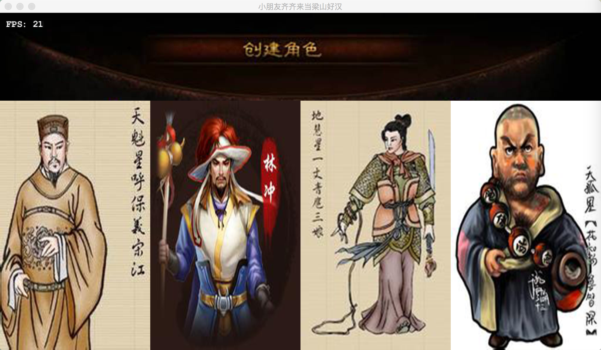
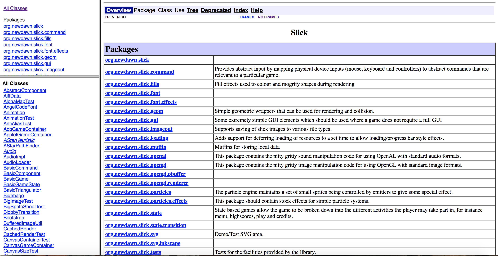
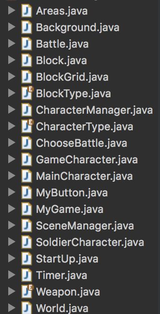
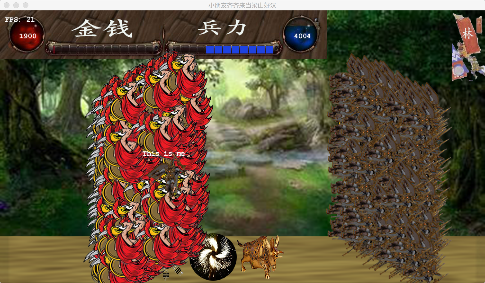
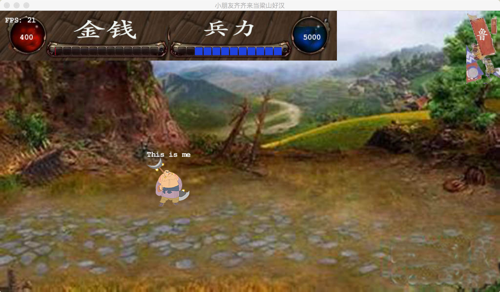
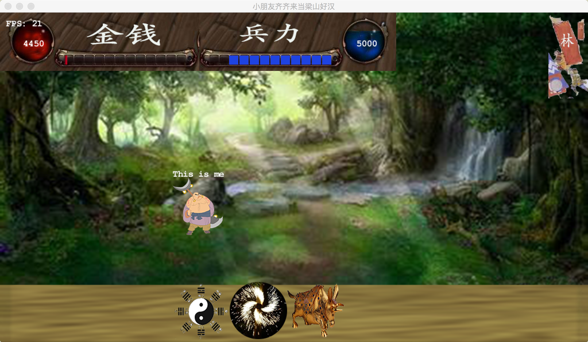
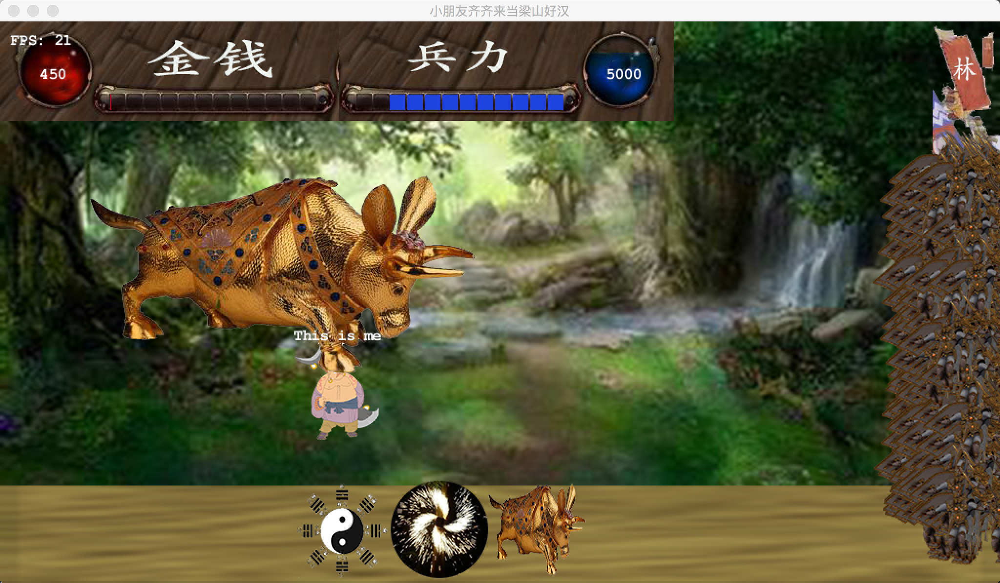

# Java大程：My水浒乱斗游戏

* Author: 黄卓斐		
* Id: 3130100677

## 一、程序设计原理、目的，算法说明

###1. 游戏介绍

这是一款以水浒传为背景的2D游戏，在图形渲染上使用java slick2D引擎进行开发，slick2d的官网网址如下，对于这个游戏的java类的使用有比较完整的说明。
	
	http://slick.ninjacave.com

游戏的希望发展成为一个带动画的RPG，玩家进入游戏前可以选择四个主角之一，每个主角拥有不同的战斗力和防御力，在游戏后续发展中有着重要作用。

作为Java课的大程，我们这里将OOP面向对象程序设计的思路完全应用上去。我们将维护一个世界类`World`，角色类，场景管理器类，计时器类和自定义用户点击按钮的交互的UI类等等。我们这样分类设计的目的是使得游戏后期的可扩展性增强，让我们比较方便地加入新的游戏元素。

这里的算法主要针对于OpenGL的纹理绑定以及人物动画的一些计算，包括人物行走时人物图片旋转的角度等，会在稍后部分详细说明。

###2.程序流程框图、调用函数关系、文件列表 

####(1) 文件列表

这个游戏一共封装了20个类，每个类都有其独特的功能，位于`src/`下。

图片资源文件位于`res/`下，内还包括.ogg格式音频文件作为游戏音效。

####(2) 流程说明

* MyGame: 整个游戏的主类，包括程序的入口以及与游戏逻辑密切相关的几个重要方法。它继承了slick2d游戏引擎的基类`BasicGame`，这个游戏基类的执行逻辑非常清晰，我们的重点是重写基类的三个成员方法：`init`,`update`, `render`。

> init：游戏初始化的动作，该方法在游戏开始时刻仅执行一次，我们把游戏内容初始化的代码放到这个函数里面。这里我们做几件事情：初始化场景管理器`manager`；启动音效，包括战斗时刻的音效以及普通状态下的音效；启动界面初始化；全局计时器开启。

	public void init(GameContainer container) throws SlickException {
		this.container = container;
		//初始化场景管理器
		manager = new SceneManager();
		
		//配音效
		music = new Music("res/music.ogg");
		battle_music = new Music("res/battle.ogg");
		music.play();
		
		//启动界面
		startup = new StartUp();
		
		World.TIMER.start();
	}

>
>
> update：游戏逻辑的重要部分，update方法和render方法在游戏过程中会不断被循环调用，顺序是先update再render。顾名思义，update显然包含了游戏过程中数据逻辑部分的维护和更改，这里面我们需要维护几个游戏状态：开始界面等待用户选择主角(2)，开始游戏后主角的行走(0)，以及攻占城池过程的战斗状态(1)。为0时我们调用场景管理器的`randomMoveCharacter`方法来控制除主角外所有角色的随机移动。战斗状态时我们需要在update函数里判断战斗是否结束。战斗结束后根据战斗结果来判断城池的归属。最后就是判断用户是否点选了选择武器的按钮使游戏状态进入战斗模式1。

	@Override
	    public void update(GameContainer container, int delta) throws SlickException {
	    	
	    	container.setTargetFrameRate(20);
	    	input();
	    	
	    	if (game_state == 0) {
	    		manager.randomMoveCharacter();
	    		
			}
	    	
	    	//战斗状态
	    	if (game_state == 1) {
	    		
	    		battle.update();
	    		game_state = 0;
	    		//System.out.println(battle.attackRest());
	    		//System.out.println(battle.offenseRest());
	    		
	    		switch (battle.checkEnd()) {
				case 0://还在打
					game_state = 1;
					System.out.println("both alive");
					break;
				case 1://防守方
					System.out.println("offense died");
					//城池被攻占
					manager.setAreaOwner(manager.getCX(), manager.getCY(), battle.attacker);
					game_state = 0;
					manager.main_game_character.battle_mod = 0;
					break;
				case 2://进攻方
					System.out.println("attack died");
					game_state = 0;
					manager.main_game_character.battle_mod = 0;
					break;
				case 3://平手
					System.out.println("both died");
					game_state = 0;
					manager.main_game_character.battle_mod = 0;
					break;
				default:
					break;
				}
	    		if (game_state == 0) {
	    			battle_music.stop();
	        		music.play();
				}
			}
	    	
	    	//主角移动
			manager.moveMainCharacter(step_len);
			
			//检查城池归属
			manager.check(manager.main_game_character);
			for (MainCharacter mc : manager.leader) {
				manager.check(mc);
			}
			
	  		//计时器，主将的金钱以每秒50的数量递增
	  		World.TIMER.end();
	  		if (World.TIMER.getTime() > 1000) {
	  			manager.main_game_character.addMoney(50);
	  			World.TIMER.start();
			}
	  		
	  		if (manager.main_game_character.battle_mod != 0 && game_state == 0) {
	  			music.stop();
	    		battle_music.play();
	  			game_state = 1;
				battle = new Battle(manager.main_game_character.battle_mod);
				battle.init(manager.main_game_character, manager.getCurrentArea().owner, 1, 500, manager.getCX(), manager.getCY());
			}
	    }

> render：在游戏主循环中被循环调用，用来渲染屏幕，呈现游戏画面。这里的逻辑相比于update更加简单，只要在场景管理器里维护好场景节点的所有数据，只需要在这里将所有元素遍历一遍，绘制在屏幕相应的位置就可以了，比如这里绘制场景和人物。其中注意graphics类的drawString方法用来在屏幕上显示文字。

	public void render(GameContainer container, Graphics graphics) throws SlickException 
	{
		glClear(GL_COLOR_BUFFER_BIT);
       	
       	//开启游戏状态
       	if (game_state == 2) {
       		startup.play();
		}
		else {
			//再画角色
			manager.draw();
			
			if (game_state == 1) {
				battle.draw();
			}
			
			graphics.drawString("This is me", manager.main_game_character.getX(), manager.main_game_character.getY() - 15);
			
			//显示金钱剩余值和兵力剩余值
			graphics.drawString("" + manager.main_game_character.getMoney(), 40, 45);
			graphics.drawString("" + manager.main_game_character.getNum_of_soldiers(), 620, 45);
		}
	}

> 额外函数: 
> 
> 键盘监听keyPress: 用来监听键盘事件，玩家通过控制上下左右控制人物行走，还有P键去除音效，O键恢复音效等。
> 
> 鼠标监听Mouse.isButtonDown(0): 判断鼠标是否按下，根据点选位置的坐标来决定需要做的操作：

		if (Mouse.isButtonDown(0)) {
  			//mouseEnabled = true;
  			int mousex = Mouse.getX();
  			int mousey = World.SCREEN_HEIGHT - Mouse.getY() - 1;
 
   			...
  		}

* SceneManager类：场景管理器类，里面维护了许许多多重要的对象，继承了角色管理器以外，还维护了整个场景里的所有元素，包括背景内容，所有领地的属性，当前显示的场景内容，主角的士兵数量和金钱数量的显示。

	
		public class SceneManager extends CharacterManager {
			//一共10*10个场景
			private final int SCENE_WIDTH = World.SCENE_WIDTH, SCENE_HEIGHT = World.SCENE_HEIGHT;
			//100个领地场景
			private Areas areas[][] = new Areas[SCENE_WIDTH][SCENE_HEIGHT];
			
			//当前显示场景，屏幕左上角开始
			private int display_x = 0, display_y = 0;
			
			//主角的金钱条和士兵条
			private Image money_bar = null, soldier_bar = null;
			
			private Image money_num = null, soldier_num = null;
			
			//当前领地归属者
			private Image[] owner_map = new Image[4];
			
			private ChooseBattle choose_battle = new ChooseBattle();
			
			......
			
角色管理器类的定义如下：包括了主将的对象，场景内的角色列表等。即维护了整个游戏里面所有人物的属性。
		
		public class CharacterManager {
	
			protected int width = World.SCREEN_WIDTH, height = World.SCREEN_HEIGHT;
			
			//主角
			protected MainCharacter main_game_character = new MainCharacter(CharacterType.LU, 0, 0, 300, 300);
			
			//另外三个主将
			public MainCharacter[] leader = {
				new MainCharacter(CharacterType.SONG, 1, 1, World.SCREEN_WIDTH / 2, World.SCREEN_HEIGHT / 2),
				new MainCharacter(CharacterType.HU, 2, 0, World.SCREEN_WIDTH / 2, World.SCREEN_HEIGHT / 2),
				new MainCharacter(CharacterType.LIN, 0, 1, World.SCREEN_WIDTH / 2, World.SCREEN_HEIGHT / 2),
			};
			
			//角色列表
			protected List<GameCharacter> character_list = new ArrayList<GameCharacter>();

* Battle类：战斗过程

该类维护了战斗过程中对战双方的一些信息，我们这里设置了四种战斗模式：兵对兵，以及另外三种武器对兵，三种武器分别对兵有相应的杀伤力。此外还有进攻方和防守方的队列，战斗过程中造成的减员要有相应的数据维护。还有战斗过程的人物动画Animation类对象。

	public class Battle {
	
		//战斗模式
		private int battle_mod = 0;
		
		int i, j;
		//进攻方，防守方
		public MainCharacter attacker, offenser;
		
		//进攻队列，防守队列
		public List<GameCharacter> attack_list = new ArrayList<GameCharacter>(), offense_list = new ArrayList<GameCharacter>();
			
		private Timer timer = new Timer();
		
		//战斗动画效果
		private Animation animation = new Animation();
		Image[] images = new Image[4];
		
		...

战斗过程与游戏主类中采用相同的框架，即update和draw方法控制战斗过程，当然还有重要的checkEnd函数判断战斗是否结束。

* World类：世界类，维护了一些全局的常量。比如屏幕宽度，长度等重要信息，还有游戏背景贴图的方块边长等。

		public class World {
			public static final int BLOCK_SIZE = 32;
			public static final int BLOCKS_WIDTH = 48, BLOCKS_HEIGHT = 40;
			
			public static final int CHARACTER_SIZE = 100;
			
			//total size of the whole world
			public static final int WORLD_SIZE = 10000;
			public static final int SCENE_WIDTH = 10, SCENE_HEIGHT = 10;
			
			//屏幕大小
			public static final int SCREEN_WIDTH = 1024, SCREEN_HEIGHT = 576;
			
			//随机数生成器
			public static Random RAND = new Random();
			
			//世界计时器
			public static Timer TIMER = new Timer();
			
			//场景类型
			public static String scenery[][] = {
				{"simple", "city", "city", "city", "shop", "city", "city", "city", "simple", "city"},
				{"city", "city", "city", "city", "city", "city", "soldier", "city", "city", "city"},
				{"shop", "city", "city", "simple", "city", "city", "city", "shop", "city", "simple"},
				{"city", "city", "soldier", "city", "city", "island", "city", "city", "city", "city"},
				{"simple", "city", "city", "city", "simple", "city", "city", "city", "soldier", "simple"},
				{"city", "simple", "city", "shop", "city", "city", "city", "city", "city", "city"},
				{"city", "city", "city", "city", "city", "city", "city", "simple", "city", "shop"},
				{"city", "city", "city", "city", "simple", "city", "shop", "city", "city", "city"},
				{"city", "city", "city", "city", "city", "shop", "city", "simple", "city", "city"},
				{"city", "shop", "city", "city", "city", "city", "city", "city", "city", "soldier"}
			};
			
		}

* GameCharacter类：游戏角色

该类包含了游戏内的所有游戏角色，他们都拥有共同的一些属性，比如行走状态，这里为了实现人物行走的动画效果，我们维护（向左，向右，向上，向下，死亡，消失）六个状态，其中死亡和消失两个状态是为了实现角色战斗死亡后一段时间内才消失的效果。
角色的绘制方法draw是根据人物的状态来决定，若在行走时，则播放人物行走的动画。反之则显示人物的静态图片。

	public void draw() {
		
		switch (isMoving) {
		case UP:case DOWN:
			animation.draw(x, y);//运动状态，则动画
			break;
		
		case LEFT:
			setLeft();
			animation.draw(x, y);//运动状态，则动画
			break;
		case RIGHT:
			setRight();
			animation.draw(x, y);//运动状态，则动画
			break;
		case STOP:
			image.draw(x, y);//停止状态，则画图
			break;
		case DIED:
			setDead();
			image.draw(x, y);
			break;
		case DISAPPEAR:
			break;
		}
		
	}

人物的行走动画是一个重点和得意点，在第三部分详细介绍。

###(3) 难点，得意点

* GameCharacter类人物行走动画

人物绘制需要载入图片，但只有一张图片要实现人物行走的动画，需要经过一些旋转图像的计算。给被打飞的人物设置几个状态，即在空中飞出的几个状态，每次飞行15°，制造出人物被“打飞”的效果。

	//在仍在行走的过程中，将人物置为死亡状态
		public void setDead() {
			if (faceDir == MoveState.LEFT) {
				//moveRight(20);
				image = type.left_dead[0];
			}
			else {
				//moveLeft(20);
				image = type.right_dead[0];
			}	
			
			if (angle <= 180) {
				if (faceDir == MoveState.LEFT)
					x = round_x + radius - radius * (float)Math.cos(angle);
				else 
					x = round_x - radius + radius * (float)Math.cos(angle);
				
				y = round_y - radius * (float)Math.sin(angle) - image.getHeight();
				angle += 15;
				//开启计时器
				timer.start();
			}
			else {
				timer.end();
				if (timer.getTime() >= 5000) {
					setMoveState(MoveState.DISAPPEAR);
				}
			}
		}
		
		//重置飞行角度为0,并设定飞行半径
		public void resetAngle(int radius) {
			angle = 0;
			round_x = x;
			round_y = y;
			this.radius = radius;
		}

五百人打五百人的战斗场面下，飞行动画效果略显壮观。

* MyButton自定义按钮的定制

自己编写一个类似于awt Button的基类，实现点选屏幕上某元素的按钮效果。比如我的启动界面:

鼠标点选人物会高亮然后进入游戏界面，MyButton实现如下：

	public class MyButton {
	
		/**按钮的位置和宽高*/ 
		protected int posX, posY, width, height;
		protected Image[] current = new Image[3];
		protected String key;
		
		protected boolean isClicked = false;
		
		public MyButton(int posX, int posY, String key) {
			this.posX = posX;
			this.posY = posY;
			this.key = key;
			
			try {
				current[1] = new Image("res/" + key + ".png");
				current[2] = new Image("res/" + key + "_lux.png");
				current[0] = current[1];
			} catch (SlickException e) {
				// TODO Auto-generated catch block
				e.printStackTrace();
			} 
			
			this.width = current[0].getWidth();
			this.height = current[0].getHeight();
		}
		
		//draw the button
		public void draw() {
			current[0].draw(posX, posY);
		}
		
		public int onClicked() {
			return 0;
		}
		
	}

其中自定义的onClicked方法本身作为一个意义上的纯虚函数，但这里为了方便还是给了一个函数实体，而实际上不会被调用，因为在startUp开始界面的类中定义的ChooseButton类会override这个方法。

	private static class ChooseButton extends MyButton {
		
		private int cur = 0;
		
		public ChooseButton(int posX, int posY, String key) {
			super(posX, posY, key);
			// TODO Auto-generated constructor stub
		}
		
		@Override
		public int onClicked() {
			
			//松开=没被按下+上一时刻刚好被按下
			if (Mouse.isButtonDown(0)) {
	  			int mousex = Mouse.getX();
	  			int mousey = World.SCREEN_HEIGHT - Mouse.getY() - 1;
	  			
	  			if (mousex >= posX && mousex <= posX + width && mousey >= posY && mousey <= posY + height) {
					current[0] = current[2];
					
					if (key.equals("ch1")) {
						cur = 1;
					} else if (key.equals("ch2")) {
						cur = 2;
					} else if (key.equals("ch3")) {
						cur = 3;
					} else if (key.equals("ch4")) {
						cur = 4;
					}
					
				}
	  			else {
					current[0] = current[1];
				}
	  		}
			else {
				current[0] = current[1];
				return cur;
			}
			
			return 0;
		}
		
	}

在上面的switch语句中，判断点选的是哪个人物，就以哪个人物作为主角。于是实现了自定制的按钮功能，以后凡是需要用到鼠标点选功能后高亮提示的按钮，可以继承这个MyButton类，非常方便。

* 动画效果

slick2d中Animation类帮助我实现动画的效果，这里将动画看做视频帧，相当于一个animation由一批图片文件组成。如下为人物动画，我们将人物行走的左方向和有方向导入，然后对图像做10度的旋转，使人物行走时有动画效果。然后调用animation的构造函数，将Image数组作为参数构造即可。

	try {
		left_images[0] = new Image(left);
		left_images[1] = new Image(left);
		left_images[1].rotate(10);//逆时针为正，顺时针为负
		
		left_dead[0] = new Image(left);			
		left_dead[0].rotate(90);
		
		right_images[0] = new Image(right);
		right_images[1] = new Image(right);
		right_images[1].rotate(-10);
		right_dead[0] = new Image(right);
		right_dead[0].rotate(-90);
		
	} catch (SlickException e) {
		// TODO Auto-generated catch block
		e.printStackTrace();
	}
			
	left_animation = new Animation(left_images, 10);
	right_animation = new Animation(right_images, 10);
	

###(4) 程序使用说明

* 开启游戏后点选人物，进入游戏界面

* 按上下左右人物行走，注意右上角表示当前领地的归属者，比如上图我选了鲁智深，右上角是“鲁”，说明是我的领地，我不能攻占城池。

* 进入别人的领地后，我们可以发动攻城。然后可以选择进攻模式，根据兵力来选择出战的人数（蓝色兵力条）。

* 按下B键，战斗是多人对多人

* 点选第三个阵法，可以发动金牛技能与敌人战斗

战斗胜利后会占领该城池。

###(5) 结论展望 

这次游戏效果并没有很多，但是实现上细节需要花很多功夫，比如人物被打飞的飞行轨迹需要用三角函数来计算，动画需要图片的某个角度旋转。尽管没有很多游戏效果，但是完整地OOP类设计保留了极大的可拓展性。因为这个游戏已经封装了场景管理器，角色管理器，Battle类，MyButton按钮类等基本元素，所以往里面加入新功能只需要数行代码，而且层与层之间的耦合降低，比较容易将类与类之间隔离开发。所以源代码我上传到github上，便于以后维护。
这个程序的可扩展性还在于我可以在这个框架的基础上将它演化成类似于3D的游戏，不过也只是将每个类的draw方法的具体绘制函数进行调整，而类的数据逻辑可以基本保持不变，希望今后能够将这个程序继续维护发展下去，加入动态场景，比如在某些城池内有随机走动的武将可以被拉拢等等，变成一款真正的属于自己的My水浒英雄传。

github链接：

	https://github.com/hzfGuardian/ShuiHu

